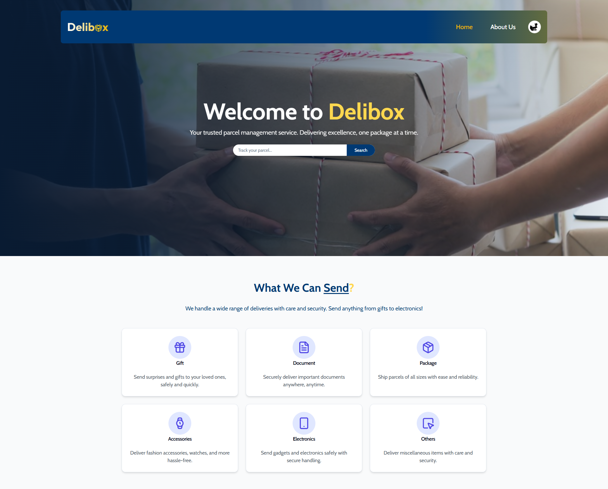

# Delibox
A Parcel Delivery Management System

## Description
Delibox is a parcel delivery management system that allows users to send and receive parcels. It is a web application that is built using the MERN Stack. The application allows users to create an account, login, book parcels, receive parcels, and track parcels. The application also allows users to view their parcel history and update their profile information.

## Features
- User Authentication
- Parcel Booking
- Parcel Management
- Profile Management
- Parcel History
- User Dashboard
- Delivery Man Dashboard
- Admin Dashboard
- Admin Management
- Admin Parcel Management
- Admin User Management
- Admin Parcel History
- Admin Profile Management
- Admin User History
- Admin User Parcel History
- Admin User Parcel Management
- Admin Change User Role
- User Book Parcel
- User Update Booked Parcel
- User give Review
- Delivery Man Update Parcel Status
- Delivery Man Receive Feedback

## Technologies
### MERN Stack

  
  
  
  

  
MongoDB - Express - React - Node

## NPM Packages
- axios
- firebase
- react
- JWT Auth
- react-router-dom
- shadcn UI
- framer motion

## Desktop View

## Live Preview 
[Delibox Live Site](https://delibox-amirulkanak.web.app/)